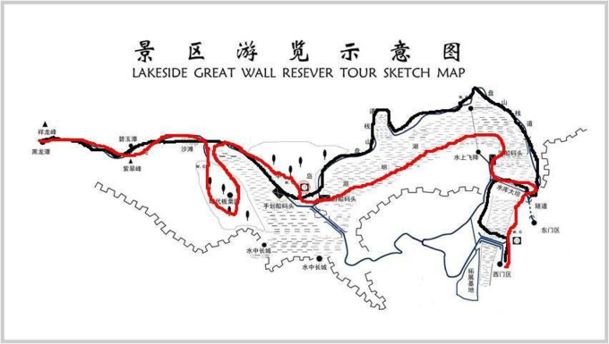
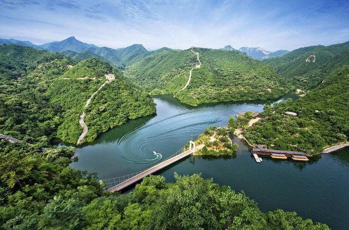
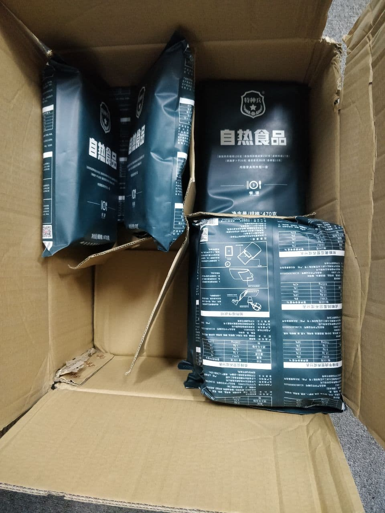
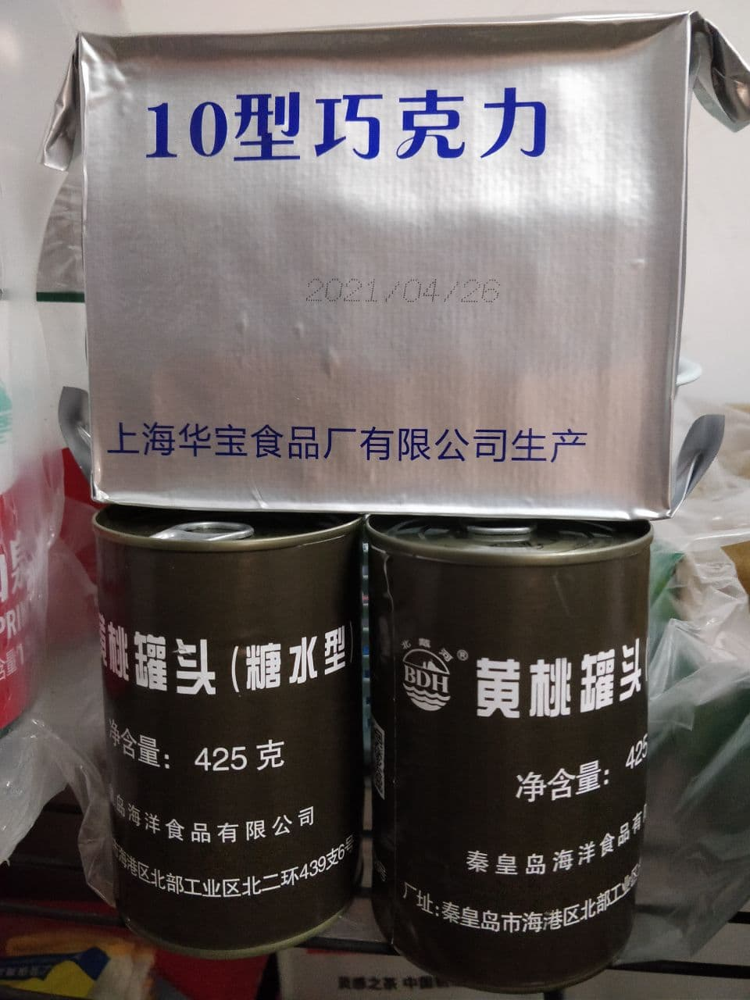

# 长城黄花城段

## 概况

* 我们 __六月25、26日__ 去黄花城长城 picnic！(如果26日不下雨的话。)
由于后来建水库淹了一段，所以黄花城也叫做黄花城水长城。

* 下图是 openstreetmap 上的相关部分地图。
这是一张 11200x2400 的超大图片，请下下来放大慢慢看。
也可以去谷歌地图上看卫星图，可以清晰地看到敌楼，但是谷歌地图没有小路和公开GPS轨迹。
前一天(第0天)住在山脚下的黄花城村里，转天(第1天)早起上山。
大致路线是从黄花城村从小路上长城，走到黄花城长城景区下山回家。
长城段约有 __5km__。

   

* 地图最左边(西边)是黄花城景区，我计划将那里作为终点。
下图左是景区地图，下图右是景区风景，可以看到有两段长城被淹，与两张地图相符。
<table border="0">
    <tr>
        <th></th>
        <th></th>
    </tr>
</table>

## 日程安排

### 交通

第一天几点走是取决于交通的。

* ~~圆明园地铁站 至 东直门汽车站：39min 圆明园--(4号线)-->西直门--(2号线)-->东直门--(走的)-->东直门汽车站~~
* ~~东直门汽车站 至 怀柔汽车站：1h25min 916~~
* 清河火车站 至 雁栖湖站：61min 14:34 - 15:35
* 怀柔汽车站/于家园汽车站 至 黄花镇村：1h35min H14/H51/H21/H37 末班车约六点，基本上 10min 一班

### 时间表

第 x 日|时间段|计划
:-----:|:----:|:-:
第 0 日 | 一点半 至 三点半 | __一点半近春园西楼集合__，打车去清河火车站，火车 14:34 开车，提前 5-8 分钟停止检票
第 0 日 | 三点半 至 五点半 | 打车去怀柔市区吃晚饭
第 0 日 | 五点半 | 在于家园公交站或者怀柔汽车站等进山的公交 H14/H51/H21/H37
第 0 日 | 七点 至 九点半 | 到达黄花镇村，安顿下来，探转天上山的路，自由活动
第 0 日 | 九点半 至 十点 | 介绍明日路线、对讲机使用，装包
第 0 日 | 十点 | 睡觉，谁不睡谁是儿子
第 1 日 | 六点 | 出发，起床时间自行掌握
第 1 日 | 全天 | 爬山，乘凉，打牌，下山，坐车回家

## 物资准备

### 人人都有

项目|明细|准备方式|备注
:-:|:-:|:-----:|:-:
第0天喝的水     |1L                        |一起去超市买
运动饮料        |500mL                     |一起去超市买|谨防晕倒
杂物0          |纸巾湿巾                    |一起去超市买
第1天午饭       |单兵自热、黄桃罐头            |我准备
能量补充        |巧克力、牛肉、威化饼干         |我准备，欢迎准备其他零食|不要太咸
头灯           |                          |我富裕两个|以免到晚上还没下山
杂物1          |手套、筷子                   |我准备|手套用于爬山，筷子用于吃饭
第1天早点       |                          |自备
杂物2          |充电宝充电器、换洗衣物、牙刷牙膏、防晒遮阳、扑克牌、身份证学生证|自备
第1天喝的水     |3L                        |山脚下村儿里买

<!--下图是一些物资的照片
<table border="0">
    <tr>
        <th></th>
        <th></th>
        <th></th>
    </tr>
</table>-->

### 有的人有

* 对讲机
* 救生绳
* 药品：碘酒棉签、Picaridin、抗过敏药物、藿香正气
* 垃圾袋
