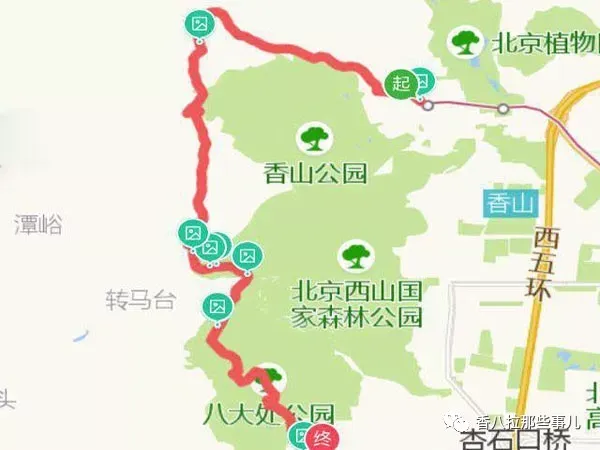
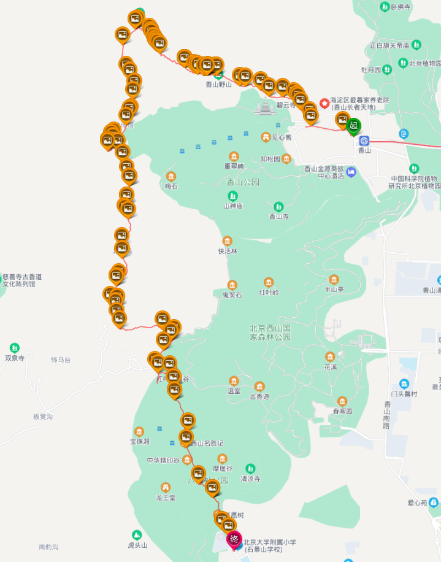

## 安排
1. 早上九点半香山邮局集合
2. 爬一天山，全程 12 km，中午在南马厂水库吃午饭，到八大处下山各回各家

<table border="0">
    <tr>
        <th></th>
        <th></th>
    </tr>
</table>

## 需要准备

1. 午餐，丰俭由人
2. 水，大约每人 1.5L
3. 零食和能量食品，注意不要太咸
4. 身份证学生证、餐巾纸湿巾、碘酒棉签、垃圾袋、扑克牌、充电宝、防晒、筷子、黄桃罐头...
5. 少许热饮（e.g. 咖啡），可以显著提升幸福感（thanks to @Ber-Lin）
6. 手套、登山杖、防滑鞋、防水毯...

## 参考资料

1. [【图说香八拉】北京近郊最经典的户外徒步路线，没有之一](https://zhuanlan.zhihu.com/p/141605770)
    * 都说香八拉有N种走法，N大于等于10，但最经典的线路也是香八拉的由来：香山邮局到八大处公园的拉练
    * 香山邮局-好汉坡-望京楼-猴子爬-挂甲塔-南马场水库-翠微绝顶-八大处公园
    * 全程12.23KM，预计耗时6.5h，累计爬升803，下降650
    * 香山邮局...如果你是新手第一次走香八拉，可以牢牢记住记住这个地方，或者度娘香山邮局，就是集合起点了

2. [户外入门路线 —— 香八拉（12 公里爬升 670 米）](https://zhiqiang.org/outdoor/xiangbala.html)
    * 香八拉...被称之为户外徒步的入门线路。...这次走的路线一共 12 公里，爬升 670 米
    * 该线路是穿越路线，所以不适合自驾（需要从八大处打车回到香山取车）。线路一般起始点在香山邮局（西郊线出来便是），如果想少走点路，可以打车或自驾到玉皇顶或者香山公园北门。但最终肯定要经过「西山小院贰号院」，所以约伴可以约在贰号院集合
    * 然后走好汉坡、猴子爬、挂甲塔、北马场直到南马厂水库。水库适合吃中饭，时间刚好，地方也适合。此处有小卖部，可以买泡面，还提供桌椅
    * 接着从水库出发走到西山公园的香巴拉茶棚，再从茶棚沿防火道走到八大处。一路游人众多，不会走随便问人即可