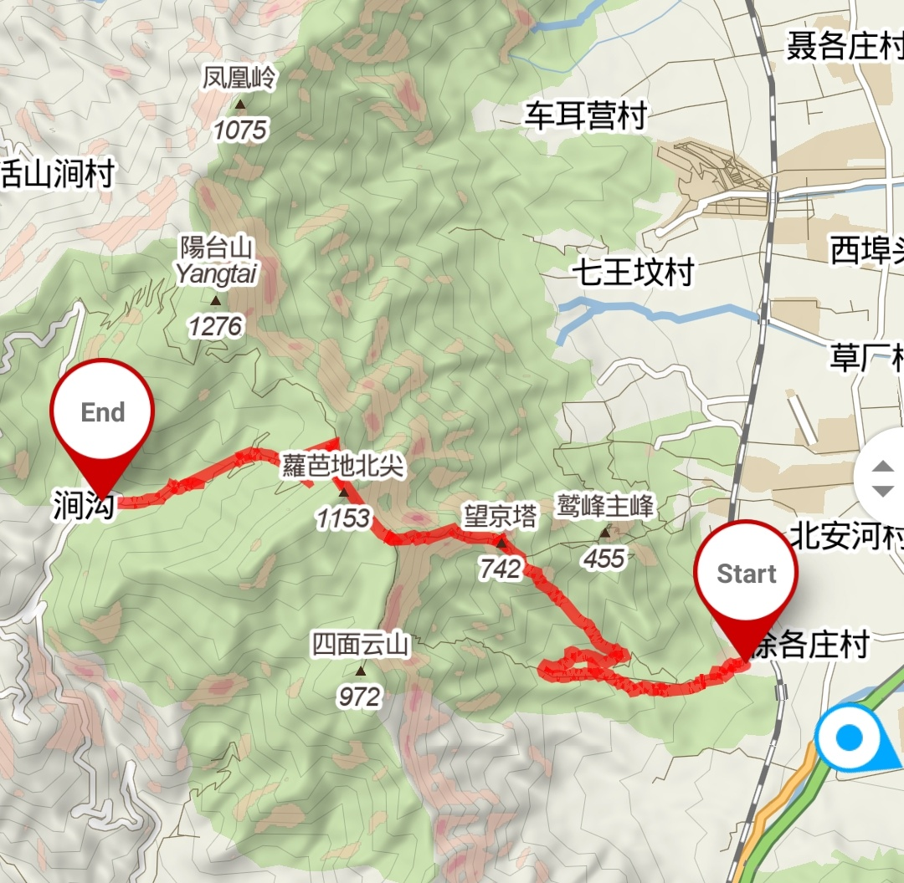
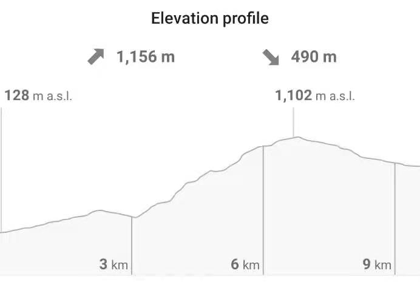

## 安排

1. 周日早 8:30 在清芬园十字路口集合，打车去大觉寺景区。~~先坐四号线到西苑，再转16号线到北安河，最后打五公里车直接到景点。~~
2. 爬一天山，长度 22.1 km，爬升 1889 m，之后原路返回。
3. 如果体力不支或者时间安排上出了问题，可以在涧沟村下山，少走 8.1 km，涧沟村下午四点有一班 M5 路进城
4. 错过 M5 可联系农家乐搭车出山（15 元 / 人），或路边拦车（看有没有运气遇见好心人）

<table border="0">
    <tr>
        <th></th>
        <th></th>
    </tr>
</table>

## 需要准备

1. 午餐，丰俭由人
2. 水，至少 1.5L 每人，推荐 2L
3. 零食和能量食品，注意不要太咸
4. 身份证学生证、餐巾纸湿巾、碘酒棉签、垃圾袋、扑克牌、充电宝、头灯、对讲机、防晒、筷子、黄桃罐头...
5. 少许热饮（e.g. 咖啡），可以显著提升幸福感（thanks to @Ber-Lin）
6. 手套、登山杖、防滑鞋、防水毯...

## 参考资料

1. [三峰环穿（大觉寺-鹫峰-阳台山-妙峰山-大觉寺）](https://www.2bulu.com/mc/community/detail?id=74004666)

    * 三峰环穿（大觉寺-鹫峰-阳台山-妙峰山-大觉寺）
      行程：4--9小时
      长度：约23公里

    * 起点位于北京西山大觉寺

    * 徒步约3.2km左右到达望京楼，海拔约760m

    * 徒步约5km左右到达萝芭地北尖, 海拔约1140m, 此时爬升将近800m. 过了北尖儿有补给点，补给相对丰富

    * 徒步约7.5km左右到阳台山山顶, 海拔约1273m. 阳台山山顶有一个巨大的石头堆, 也是很多来三峰的打卡点

    * 徒步约11.6km左右到妙峰山山顶, 海拔约1280m. 这里有一个标志性的铁塔, 走到这里, 此路线也算是完成一半了

    * 徒步约14.4km左右到达涧沟村, 海拔约780m, 此处可以补给. 涧沟村每天下午4点有公交车, 这里也是一个下撤点

2. [三峰连穿：北京驴友眼中最经典户外拉练路线，没有之一](https://zhuanlan.zhihu.com/p/78501862)

    * 三峰连穿全程23KM，累计爬升1868m. 全程23KM，累计爬升1868m，适合新人拉练预计10h可完成

    * 大觉寺-鹫峰望京楼-萝卜地北尖儿-妙儿洼-阳台山-三界碑-白宫-天池-妙峰山-涧沟村-萝卜地-冷风口-绝望坡-大觉寺

## 最终实现

<table border="0">
    <tr>
        <th></th>
        <th></th>
    </tr>
</table>

脚注：

1. 雪天路况还是有一些复杂，下山最好需要登山杖、防滑鞋
2. 道旁植物带刺，需要手套
